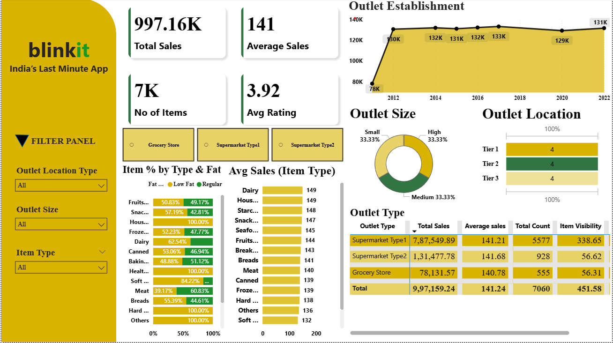

# 📊 Blinkit Sales Dashboard (Power BI)

## Overview
This repository contains a **Power BI dashboard** designed to analyze and visualize sales performance for **Blinkit**.  
The dashboard provides actionable insights into Sales trends, product categories, and performance.

## ✨ Features
- **Sales Overview**: Track total Sales, orders, and growth trends.
- **Category Analysis**: Identify top-performing product categories.
- **Customer Insights**: Understand purchase frequency.
  **Interactive Filters**: Category, and location.

## 🖼️ Dashboard Preview

## 📂 Repository Structure
- `data/` → Sample datasets used for dashboard creation  
- `pbix/` → Power BI project files (`Blinkit_Sales.pbix`)  
- `images/` → Dashboard screenshots for README and documentation  
- `README.md` → Project documentation  
